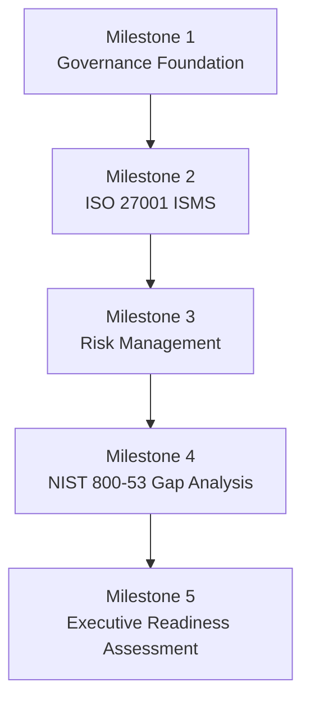

# MedSecure Health — GRC Portfolio

A portfolio-ready Governance, Risk, and Compliance (GRC) program developed for **MedSecure Health**, a fictional U.S.-based healthcare SaaS organization that handles protected health information (PHI), payment data, and cloud-hosted clinical services.

> **Disclaimer:** MedSecure Health is entirely fictional. This project was created for educational and professional portfolio purposes. It does not represent a real company, audit, certification, or legal/compliance opinion.

## Project Overview

This project demonstrates how a GRC professional can translate regulatory obligations and security frameworks into practical governance documents, risk decisions, control assessments, and executive reporting. The deliverables build on one another across five milestones.

## Deliverables

### Milestone 1 — Governance Foundation

- [Regulatory Landscape Map](Milestone-1-Governance/01_MedSecure_Regulatory_Landscape_Map.md)
- [Information Security Policy](Milestone-1-Governance/02_MedSecure_Information_Security_Policy.md)
- [Security Program RACI Matrix](Milestone-1-Governance/03_MedSecure_RACI_Matrix.md)

### Milestone 2 — ISO 27001 ISMS

- [ISO 27001 Scope and Statement of Applicability](Milestone-2-ISO27001-ISMS/04_MedSecure_ISO27001_Scope_SoA.md)
- [ISMS Policy Set](Milestone-2-ISO27001-ISMS/05_MedSecure_ISMS_Policy_Set.md)

### Milestone 3 — Risk Management

- [Risk Register](Milestone-3-Risk-Management/06_MedSecure_Risk_Register.md)
- [Risk Treatment Plan](Milestone-3-Risk-Management/07_MedSecure_Risk_Treatment_Plan.md)

### Milestone 4 — Control Gap Analysis

- [NIST SP 800-53 Gap Analysis](Milestone-4-NIST80053-Gap-Analysis/08_MedSecure_NIST80053_Gap_Analysis.md)

### Milestone 5 — Capstone

- [Information Security and Compliance Readiness Assessment](Milestone-5-Capstone/09_MedSecure_Capstone_Readiness_Assessment.md)

## Frameworks and Requirements Applied

- ISO/IEC 27001 — Information Security Management System
- NIST SP 800-53 — Security and Privacy Controls
- NIST SP 800-30 — Risk Assessment Methodology
- HIPAA Security, Privacy, and Breach Notification Rules
- HITECH Act
- HITRUST CSF
- PCI DSS
- Applicable state privacy and breach-notification requirements

## Key Skills Demonstrated

- GRC program design and governance documentation
- Regulatory applicability analysis
- Policy development and control ownership
- ISO 27001 ISMS scoping and Statement of Applicability
- Qualitative risk assessment and risk treatment
- NIST SP 800-53 control-gap analysis
- Remediation prioritization
- RACI development and stakeholder accountability
- Executive-level reporting and compliance-readiness communication

## Portfolio Narrative

The project begins by identifying MedSecure Health's regulatory environment and governance responsibilities. It then defines the ISMS scope and policy structure, evaluates realistic organizational risks, maps treatments to recognized controls, measures gaps against NIST SP 800-53, and concludes with an executive readiness assessment that synthesizes the full program.

## Author

Created by [PayloadProtector](https://github.com/PayloadProtector) as a cybersecurity GRC portfolio project.
